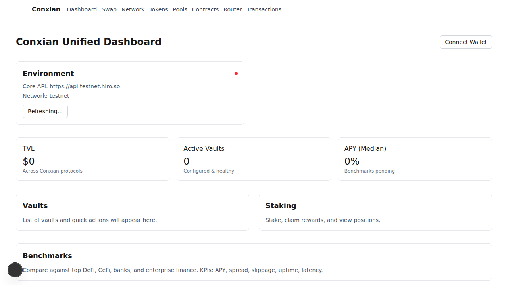

# Conxian UI Architecture

## 1. Welcome to the Conxian UI!

This document provides an overview of the Conxian UI's architecture, outlining how it functions as a decentralized application (dApp) on the Stacks blockchain.

## 2. The Big Picture: A dApp on the Stacks Blockchain

The Conxian UI is a Next.js application that empowers users to interact with Conxian smart contracts. Unlike traditional web apps, it doesn't have a central backend server. Instead, it communicates directly with the Stacks blockchain, making it a true dApp.

## 3. How We Talk to the Blockchain

The "backend" of our application is the suite of Conxian smart contracts on the Stacks blockchain. We use the Hiro API to facilitate communication between the frontend and the blockchain.

### Our Toolkit for Blockchain Interaction:

*   **`src/lib/contracts.ts`**: Think of this as our address book. It stores the locations and details of all our smart contracts, from tokens to DEX components.
*   **`src/lib/coreApi.ts`**: This is our low-level communication toolkit. It handles the nitty-gritty of making API calls to the Stacks blockchain, such as fetching balances or making read-only contract calls.
*   **`src/lib/contract-interactions.ts`**: This is where the magic happens. We use the `@stacks/transactions` and `@stacks/connect` libraries to build and send transactions, making it easy to interact with our smart contracts.

## 4. The User Interface

The Conxian UI is built with Next.js and Tailwind CSS. We also use a set of reusable UI components to ensure a consistent look and feel throughout the application.

### Our UI Toolkit:

*   **`src/components/ui/VStack.tsx`**: A reusable component for vertical stacking of elements.
*   **`src/components/ui/StatCard.tsx`**: A reusable component for displaying statistics in a card format.

## 5. The User's Journey: A Data Flow Story

Here's a step-by-step look at how data flows through our app:

1.  **A User's Click**: The journey begins when a user interacts with a UI component, like clicking the "Swap" button.
2.  **A Call to Action**: The UI then calls a function from `src/lib/contract-interactions.ts`.
3.  **A Conversation with the Blockchain**:
    *   For read-only operations (like checking a balance), we use `fetchCallReadOnlyFunction` from `@stacks/transactions` to query a Stacks node.
    *   For transactions (like making a swap), we use `request` from `@stacks/connect` to open a wallet pop-up, allowing the user to approve the transaction securely.
4.  **A Fresh Look**: The UI updates to reflect the results of the blockchain interaction, providing a seamless user experience.

## 6. Staying Ahead of the Curve: Our Tech Stack

We're committed to using the latest and greatest technologies to ensure a stable and secure platform. That's why we've updated our codebase to use the `request` method from `@stacks/connect`, replacing the deprecated `openContractCall`. This ensures we're aligned with the latest standards and best practices.

## 7. Screenshots

Below is a screenshot of the Conxian UI homepage, showcasing the main interface for interacting with the dApp.

## 8. Our Promise: A Seamless User Experience

By combining a modern frontend with the power of the Stacks blockchain, we're able to provide a user-friendly and decentralized platform for interacting with the Conxian ecosystem. We're excited to have you on board!
