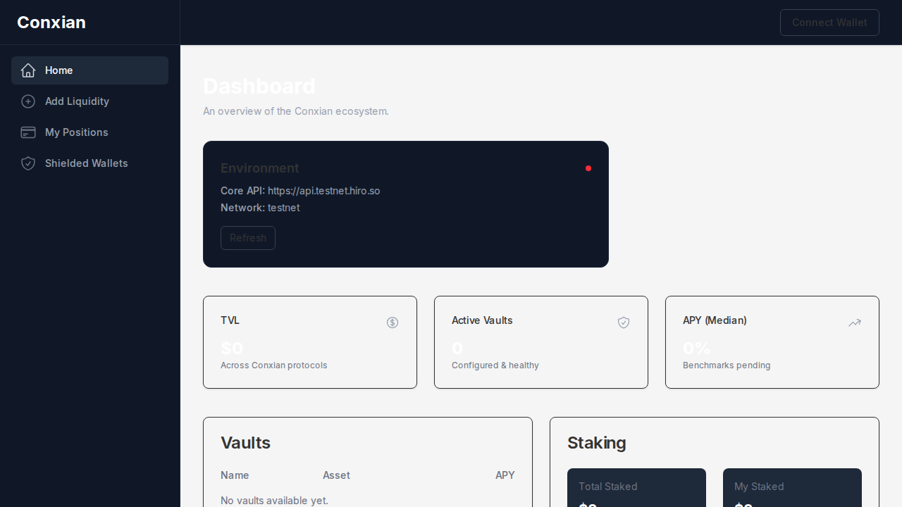
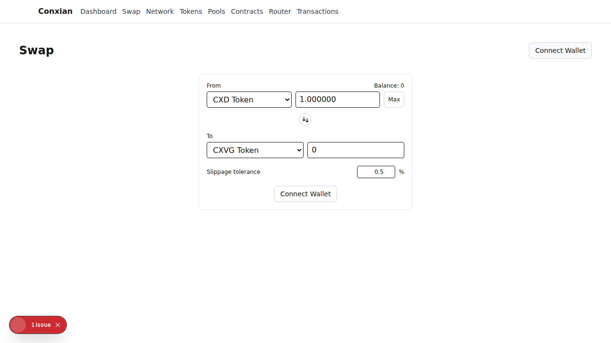
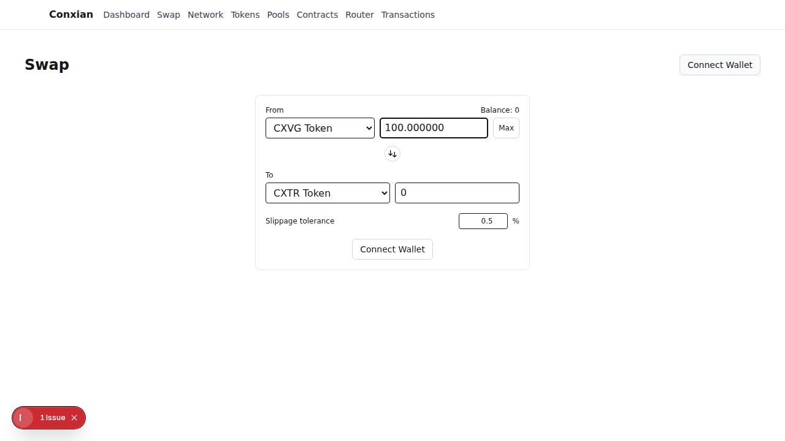
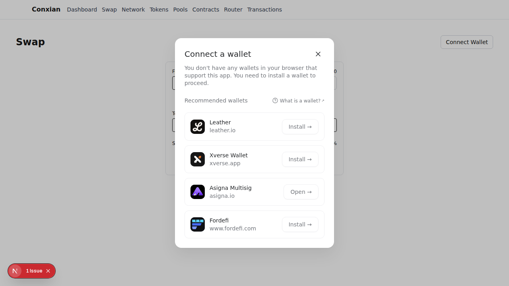

# Conxian UI User Guide

Welcome to the Conxian UI! This guide will walk you through the primary user journey: performing a token swap.

## Step 1: Connect Your Wallet

To get started, you'll need to connect your Stacks wallet.

1.  Click the **Connect Wallet** button in the top-right corner of the application.
2.  A pop-up will appear from your wallet extension, asking you to approve the connection.

## Step 2: Navigate to the Swap Page

Once your wallet is connected, head over to the swap page to begin.

1.  Click on the **Swap** link in the main navigation bar.
2.  This will take you to the main swapping interface.

## Step 3: Fill Out the Swap Form

Now it's time to choose which tokens you'd like to swap.

1.  **From**: Use the top dropdown to select the token you want to swap *from*.
2.  **To**: Use the bottom dropdown to select the token you want to receive.
3.  **Amount**: Enter the amount of the "From" token you wish to swap. The "To" amount will be estimated for you.

## Step 4: Initiate the Swap

Once you've filled out the form and are happy with the estimated amount, you can initiate the swap.

1.  Click the **Swap** button at the bottom of the form (Note: if your wallet is not connected, this button will still say "Connect Wallet").
2.  Your wallet will pop up again, asking you to confirm the transaction details. Review them carefully and approve the transaction.

After you confirm, the transaction will be sent to the Stacks network. You can monitor its progress in your wallet or on a Stacks block explorer.
